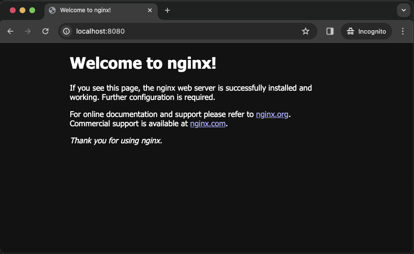

&nbsp;

Reference : 
- Doc. | Docker Kreuzwerker Provider
  <pre>https://registry.terraform.io/providers/kreuzwerker/docker/latest/docs</pre>

---

&nbsp;

## &#x1F6A9; Terraform TF-Docker-nginx = docker nginx:alpine3.18

    
    
https://hub.docker.com/layers/library/nginx/alpine3.18/images/sha256-0ea2fe4c6482b50708bb65792974641519243497e1599e5c8c003493dc1a61da?context=explore

&nbsp;

&nbsp;

### &#127937; Start terraform infastructure exercise as code.

<pre>
    ❯ vim TF-Docker-nginx/provider.tf
</pre>
<pre>
        terraform {
            required_providers {
                docker = {
                    source  = "kreuzwerker/docker"
                    version = "3.0.2"
                }
            }
        }

        provider "docker" {
            host = "unix:///var/run/docker.sock"
        }
</pre>

&nbsp;

<pre>
    ❯ vim TF-Docker-nginx/main.tf
</pre>
<pre>
        resource "docker_image" "nginx" {
            name         = "nginx:alpine3.18"
            keep_locally = false
        }

        resource "docker_container" "nginx" {
            image    = docker_image.nginx.name
            name     = "Terraform-Nginx"
            must_run = true

            ports {
                internal = 80
                external = 8080
            }
        }
</pre>

&nbsp;

<pre>
    ❯ tree -L 2 -a -I 'README.md|.DS_Store|.terraform|*.hcl|*.tfstate|*.tfstate.backup' ./TF-Docker-nginx
        ├── main.tf
        └── provider.tf

        0 directories, 2 files
</pre>

&nbsp;

### &#x1F530; TERRAFORM STAGES :

<pre>
    ❯ terraform -chdir=./TF-Docker-nginx init

            Initializing the backend...

            Initializing provider plugins...
            - Finding kreuzwerker/docker versions matching "3.0.2"...
            - Installing kreuzwerker/docker v3.0.2...
            - Installed kreuzwerker/docker v3.0.2 (self-signed, key ID BD080C4571C6104C)

            Partner and community providers are signed by their developers.
            If you'd like to know more about provider signing, you can read about it here:
            https://www.terraform.io/docs/cli/plugins/signing.html

            Terraform has created a lock file .terraform.lock.hcl to record the provider
            selections it made above. Include this file in your version control repository
            so that Terraform can guarantee to make the same selections by default when
            you run "terraform init" in the future.

            Terraform has been successfully initialized!

            You may now begin working with Terraform. Try running "terraform plan" to see
            any changes that are required for your infrastructure. All Terraform commands
            should now work.

            If you ever set or change modules or backend configuration for Terraform,
            rerun this command to reinitialize your working directory. If you forget, other
            commands will detect it and remind you to do so if necessary.
</pre>

&nbsp;

<pre>
    ❯ terraform -chdir=./TF-Docker-nginx fmt

    ❯ terraform -chdir=./TF-Docker-nginx validate

            Success! The configuration is valid.
</pre>

&nbsp;

<pre>
    ❯ terraform -chdir=./TF-Docker-nginx plan

            Terraform used the selected providers to generate the following execution plan. Resource actions are indicated with the following symbols:
            + create

            Terraform will perform the following actions:

            # docker_container.nginx will be created
            + resource "docker_container" "nginx" {
                + attach                                      = false
                + bridge                                      = (known after apply)
                + command                                     = (known after apply)
                + container_logs                              = (known after apply)
                + container_read_refresh_timeout_milliseconds = 15000
                + entrypoint                                  = (known after apply)
                + env                                         = (known after apply)
                + exit_code                                   = (known after apply)
                + hostname                                    = (known after apply)
                + id                                          = (known after apply)
                + image                                       = "nginx:alpine3.18"
                + init                                        = (known after apply)
                + ipc_mode                                    = (known after apply)
                + log_driver                                  = (known after apply)
                + logs                                        = false
                + must_run                                    = true
                + name                                        = "Terraform-Nginx"
                + network_data                                = (known after apply)
                + read_only                                   = false
                + remove_volumes                              = true
                + restart                                     = "no"
                + rm                                          = false
                + runtime                                     = (known after apply)
                + security_opts                               = (known after apply)
                + shm_size                                    = (known after apply)
                + start                                       = true
                + stdin_open                                  = false
                + stop_signal                                 = (known after apply)
                + stop_timeout                                = (known after apply)
                + tty                                         = false
                + wait                                        = false
                + wait_timeout                                = 60

                + ports {
                    + external = 8080
                    + internal = 80
                    + ip       = "0.0.0.0"
                    + protocol = "tcp"
                    }
                }

            # docker_image.nginx will be created
            + resource "docker_image" "nginx" {
                + id           = (known after apply)
                + image_id     = (known after apply)
                + keep_locally = false
                + name         = "nginx:alpine3.18"
                + repo_digest  = (known after apply)
                }

            Plan: 2 to add, 0 to change, 0 to destroy.

            ───────────────────────────────────────────────────────────────────────────────────────────────────────────────────────────────────────────────────────────────────────

            Note: You didn't use the -out option to save this plan, so Terraform can't guarantee to take exactly these actions if you run "terraform apply" now.
</pre>

&nbsp;

<pre>
    ❯ terraform -chdir=./TF-Docker-nginx apply

            Terraform used the selected providers to generate the following execution plan. Resource actions are indicated with the following symbols:
            + create

            Terraform will perform the following actions:

            # docker_container.nginx will be created
            + resource "docker_container" "nginx" {
                + attach                                      = false
                + bridge                                      = (known after apply)
                + command                                     = (known after apply)
                + container_logs                              = (known after apply)
                + container_read_refresh_timeout_milliseconds = 15000
                + entrypoint                                  = (known after apply)
                + env                                         = (known after apply)
                + exit_code                                   = (known after apply)
                + hostname                                    = (known after apply)
                + id                                          = (known after apply)
                + image                                       = "nginx:alpine3.18"
                + init                                        = (known after apply)
                + ipc_mode                                    = (known after apply)
                + log_driver                                  = (known after apply)
                + logs                                        = false
                + must_run                                    = true
                + name                                        = "Terraform-Nginx"
                + network_data                                = (known after apply)
                + read_only                                   = false
                + remove_volumes                              = true
                + restart                                     = "no"
                + rm                                          = false
                + runtime                                     = (known after apply)
                + security_opts                               = (known after apply)
                + shm_size                                    = (known after apply)
                + start                                       = true
                + stdin_open                                  = false
                + stop_signal                                 = (known after apply)
                + stop_timeout                                = (known after apply)
                + tty                                         = false
                + wait                                        = false
                + wait_timeout                                = 60

                + ports {
                    + external = 8080
                    + internal = 80
                    + ip       = "0.0.0.0"
                    + protocol = "tcp"
                    }
                }

            # docker_image.nginx will be created
            + resource "docker_image" "nginx" {
                + id           = (known after apply)
                + image_id     = (known after apply)
                + keep_locally = false
                + name         = "nginx:alpine3.18"
                + repo_digest  = (known after apply)
                }

            Plan: 2 to add, 0 to change, 0 to destroy.

            Do you want to perform these actions?
            Terraform will perform the actions described above.
            Only 'yes' will be accepted to approve.

            Enter a value: yes

            docker_image.nginx: Creating...
            docker_image.nginx: Still creating... [10s elapsed]
            docker_image.nginx: Creation complete after 18s [id=sha256:b8c82647e8a2586145e422943ae4c69c9b1600db636e1269efd256360eb396b0nginx:alpine3.18]
            docker_container.nginx: Creating...
            docker_container.nginx: Creation complete after 0s [id=2687e7f7c6738d24d55b0e4fbc733eae72e7fde591c2828b1c874c29833d4d29]

            Apply complete! Resources: 2 added, 0 changed, 0 destroyed.
</pre>

&nbsp;

### &#x1F530; Result.

<pre>
    ❯ docker images

        REPOSITORY   TAG          IMAGE ID       CREATED       SIZE
        nginx        alpine3.18   b8c82647e8a2   6 weeks ago   43.6MB

    ❯ docker container list

        CONTAINER ID   IMAGE              COMMAND                  CREATED              STATUS              PORTS                  NAMES
        2687e7f7c673   nginx:alpine3.18   "/docker-entrypoint.…"   About a minute ago   Up About a minute   0.0.0.0:8080->80/tcp   Terraform-Nginx
</pre>

    

&nbsp;

&nbsp;

<pre>
    ❯ terraform -chdir=./TF-Docker-nginx destroy

            docker_image.nginx: Refreshing state... [id=sha256:b8c82647e8a2586145e422943ae4c69c9b1600db636e1269efd256360eb396b0nginx:alpine3.18]
            docker_container.nginx: Refreshing state... [id=2687e7f7c6738d24d55b0e4fbc733eae72e7fde591c2828b1c874c29833d4d29]

            Terraform used the selected providers to generate the following execution plan. Resource actions are indicated with the following symbols:
            - destroy

            Terraform will perform the following actions:

            # docker_container.nginx will be destroyed
            - resource "docker_container" "nginx" {
                - attach                                      = false -> null
                - command                                     = [
                    - "nginx",
                    - "-g",
                    - "daemon off;",
                    ] -> null
                - container_read_refresh_timeout_milliseconds = 15000 -> null
                - cpu_shares                                  = 0 -> null
                - dns                                         = [] -> null
                - dns_opts                                    = [] -> null
                - dns_search                                  = [] -> null
                - entrypoint                                  = [
                    - "/docker-entrypoint.sh",
                    ] -> null
                - env                                         = [] -> null
                - group_add                                   = [] -> null
                - hostname                                    = "2687e7f7c673" -> null
                - id                                          = "2687e7f7c6738d24d55b0e4fbc733eae72e7fde591c2828b1c874c29833d4d29" -> null
                - image                                       = "sha256:b8c82647e8a2586145e422943ae4c69c9b1600db636e1269efd256360eb396b0" -> null
                - init                                        = false -> null
                - ipc_mode                                    = "private" -> null
                - log_driver                                  = "json-file" -> null
                - log_opts                                    = {} -> null
                - logs                                        = false -> null
                - max_retry_count                             = 0 -> null
                - memory                                      = 0 -> null
                - memory_swap                                 = 0 -> null
                - must_run                                    = true -> null
                - name                                        = "Terraform-Nginx" -> null
                - network_data                                = [
                    - {
                        - gateway                   = "172.17.0.1"
                        - global_ipv6_address       = ""
                        - global_ipv6_prefix_length = 0
                        - ip_address                = "172.17.0.2"
                        - ip_prefix_length          = 16
                        - ipv6_gateway              = ""
                        - mac_address               = "02:42:ac:11:00:02"
                        - network_name              = "bridge"
                        },
                    ] -> null
                - network_mode                                = "default" -> null
                - privileged                                  = false -> null
                - publish_all_ports                           = false -> null
                - read_only                                   = false -> null
                - remove_volumes                              = true -> null
                - restart                                     = "no" -> null
                - rm                                          = false -> null
                - runtime                                     = "runc" -> null
                - security_opts                               = [] -> null
                - shm_size                                    = 64 -> null
                - start                                       = true -> null
                - stdin_open                                  = false -> null
                - stop_signal                                 = "SIGQUIT" -> null
                - stop_timeout                                = 0 -> null
                - storage_opts                                = {} -> null
                - sysctls                                     = {} -> null
                - tmpfs                                       = {} -> null
                - tty                                         = false -> null
                - wait                                        = false -> null
                - wait_timeout                                = 60 -> null

                - ports {
                    - external = 8080 -> null
                    - internal = 80 -> null
                    - ip       = "0.0.0.0" -> null
                    - protocol = "tcp" -> null
                    }
                }

            # docker_image.nginx will be destroyed
            - resource "docker_image" "nginx" {
                - id           = "sha256:b8c82647e8a2586145e422943ae4c69c9b1600db636e1269efd256360eb396b0nginx:alpine3.18" -> null
                - image_id     = "sha256:b8c82647e8a2586145e422943ae4c69c9b1600db636e1269efd256360eb396b0" -> null
                - keep_locally = false -> null
                - name         = "nginx:alpine3.18" -> null
                - repo_digest  = "nginx@sha256:31bad00311cb5eeb8a6648beadcf67277a175da89989f14727420a80e2e76742" -> null
                }

            Plan: 0 to add, 0 to change, 2 to destroy.

            Do you really want to destroy all resources?
            Terraform will destroy all your managed infrastructure, as shown above.
            There is no undo. Only 'yes' will be accepted to confirm.

            Enter a value: yes

            docker_container.nginx: Destroying... [id=2687e7f7c6738d24d55b0e4fbc733eae72e7fde591c2828b1c874c29833d4d29]
            docker_container.nginx: Destruction complete after 0s
            docker_image.nginx: Destroying... [id=sha256:b8c82647e8a2586145e422943ae4c69c9b1600db636e1269efd256360eb396b0nginx:alpine3.18]
            docker_image.nginx: Destruction complete after 0s

            Destroy complete! Resources: 2 destroyed.
</pre>

&nbsp;

<pre>
    ❯  docker images

            REPOSITORY   TAG       IMAGE ID   CREATED   SIZE

    ❯ docker ps -a

            CONTAINER ID   IMAGE     COMMAND   CREATED   STATUS    PORTS     NAMES
</pre>

&nbsp;

&nbsp;

---

&nbsp;

    

&nbsp;
